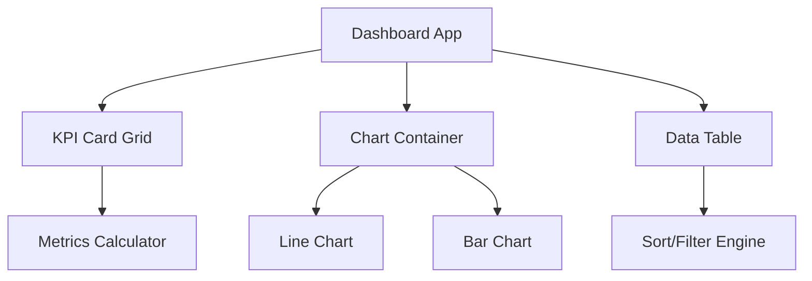

<div align="center">
  
</div>

<h1 align="center">React Analytics Dashboard</h1>

<div align="center">
  <p><strong>A real-time analytics dashboard with interactive charts, KPI cards, and responsive data tables. Built with React, TypeScript, and Recharts.</strong></p>
  
  <p>
    <a href="https://tapiwamakandigona.github.io/react-analytics-dashboard/"></a>
    
    
  </p>
</div>

---

## ⚡ What This Demonstrates

This project showcases **complex data visualization** in React — the kind of work that enterprise SaaS dashboards require. It implements composable chart components, responsive grid layouts, and real-time KPI state management without external state libraries.

<br/>

## 📊 Dashboard Components

| Widget | Implementation | Data Source |
|--------|---------------|-------------|
| **Line Charts** | `Recharts` `<LineChart>` with custom tooltips | Time-series revenue data |
| **Bar Charts** | Stacked/grouped comparison views | Category breakdown |
| **KPI Cards** | Animated number counters with trend arrows | Aggregated metrics |
| **Data Tables** | Sortable, filterable with pagination | Raw transaction logs |
| **Date Picker** | Custom range selector for filtering | User interaction |

---

## 🛠️ Technology Stack

- **Frontend:** React 19, TypeScript
- **Charts:** Recharts (composable D3-based)
- **Styling:** CSS Modules
- **Build:** Vite
- **CI/CD:** GitHub Actions → GitHub Pages

---

## 🏗️ Architecture



---

## 🚀 Quick Start

```bash
git clone https://github.com/tapiwamakandigona/react-analytics-dashboard.git
cd react-analytics-dashboard
npm install
npm run dev
```

---

<div align="center">
  <b>Built by <a href="https://github.com/tapiwamakandigona">Tapiwa Makandigona</a></b>
  <br/>
  <i>⭐ Star if you need a Recharts dashboard reference!</i>
</div>
