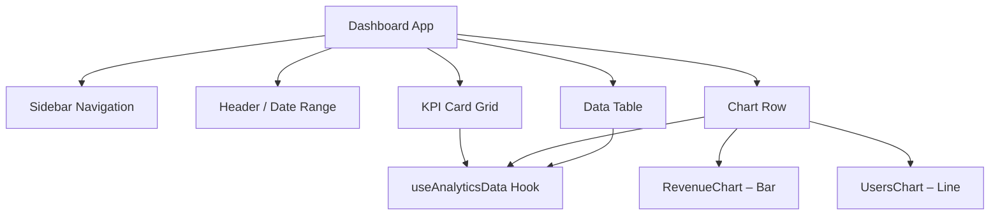

<div align="center">
  
</div>

<h1 align="center">React Analytics Dashboard</h1>

<div align="center">
  <p><strong>A real-time analytics dashboard with interactive charts, KPI cards, and responsive data tables. Built with React, TypeScript, and custom SVG visualizations.</strong></p>
  
  <p>
    <a href="https://tapiwamakandigona.github.io/react-analytics-dashboard/"></a>
    
    
  </p>
</div>

---

## ⚡ What This Demonstrates

This project showcases **complex data visualization** in React — the kind of work that enterprise SaaS dashboards require. It implements composable chart components built with custom SVG and CSS (no external chart library), responsive grid layouts, and KPI state management without external state libraries.

<br/>

## 📊 Dashboard Components

| Widget | Implementation | Data Source |
|--------|---------------|-------------|
| **Bar Charts** | Custom CSS flexbox bars with percentage height | Time-series revenue data |
| **Line Charts** | SVG `<polyline>` with calculated viewBox | Active/new user trends |
| **KPI Cards** | Metric cards with trend indicators | Aggregated metrics |
| **Data Tables** | Responsive table with status badges | Mock transaction logs |
| **Date Range Selector** | 7d / 30d / 90d toggle buttons | User interaction |

> Additional components (Sparkline, PieChart, ActivityHeatmap) are included for reuse and extension.

---

## 🛠️ Technology Stack

- **Frontend:** React 18, TypeScript 5
- **Charts:** Custom SVG & CSS (zero chart-library dependency)
- **Styling:** Plain CSS with custom properties (CSS variables)
- **Build:** Vite 5
- **CI/CD:** GitHub Actions → GitHub Pages

---

## 🏗️ Architecture


```mermaid
graph TD;
    App[Dashboard App] --> Sidebar[Sidebar Navigation];
    App --> Header[Header / Date Range];
    App --> KPI[KPI Card Grid];
    App --> Charts[Chart Row];
    App --> Table[Data Table];
    Charts --> Revenue[RevenueChart – Bar];
    Charts --> Users[UsersChart – Line];
    KPI --> Hook[useAnalyticsData Hook];
    Charts --> Hook;
    Table --> Hook;
```

### Project Structure

```
src/
├── main.tsx                    # App entry point
├── App.tsx                     # Root layout (sidebar + main content)
├── App.css                     # Global styles & CSS variables
├── components/
│   ├── Sidebar.tsx             # Collapsible navigation sidebar
│   ├── Header.tsx              # Page header with date-range selector
│   ├── KPICards.tsx             # Grid of key-performance-indicator cards
│   ├── RevenueChart.tsx        # Bar chart (CSS flexbox)
│   ├── UsersChart.tsx          # Line chart (SVG polyline)
│   ├── DataTable.tsx           # Transaction table with status badges
│   ├── PieChart.tsx            # SVG pie chart (available for extension)
│   ├── Sparkline.tsx           # Inline sparkline (available for extension)
│   └── ActivityHeatmap.tsx     # GitHub-style heatmap (available for extension)
├── hooks/
│   ├── useAnalyticsData.ts     # Generates deterministic mock data per date range
│   └── useTableSort.ts         # Reusable column-sort hook
└── context/
    └── DashboardContext.tsx     # Global state provider (theme, notifications)
```

---

## 🚀 Quick Start

```bash
# Clone the repository
git clone https://github.com/tapiwamakandigona/react-analytics-dashboard.git
cd react-analytics-dashboard

# Install dependencies (requires Node ≥ 20 — see .nvmrc)
npm install

# Start the dev server (default: http://localhost:5173)
npm run dev

# Production build → dist/
npm run build
```

### Available Scripts

| Script | Description |
|--------|-------------|
| `npm run dev` | Start Vite dev server with HMR |
| `npm run build` | TypeScript check + production build |
| `npm run preview` | Preview the production build locally |

---

## 📝 License

[MIT](LICENSE) © Tapiwa Makandigona

---

<div align="center">
  <b>Built by <a href="https://github.com/tapiwamakandigona">Tapiwa Makandigona</a></b>
  <br/>
  <i>⭐ Star if you find this dashboard reference useful!</i>
</div>
